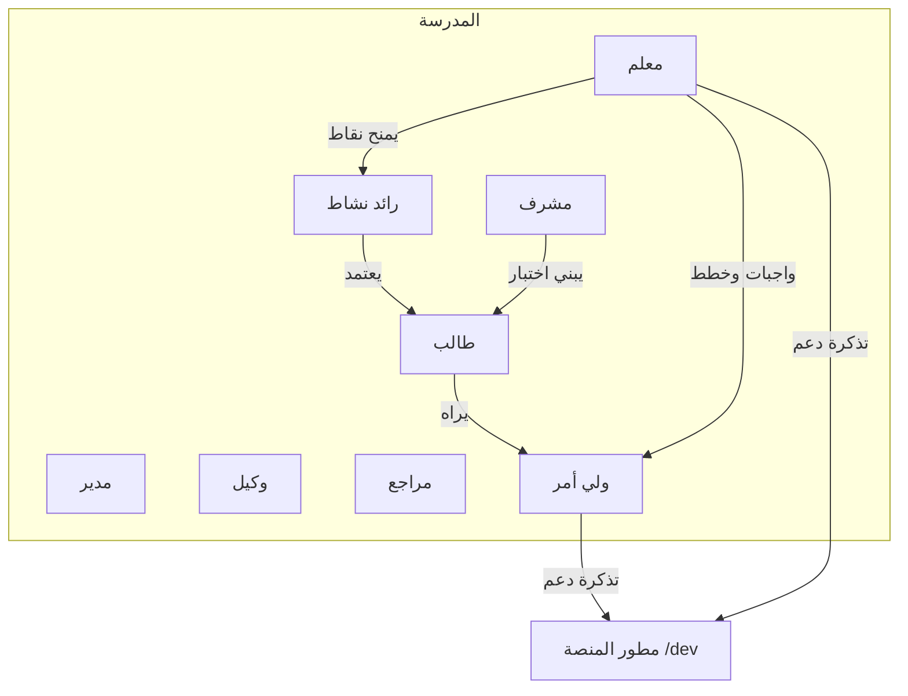

# دليل المستخدمين ومراجعة ما قبل الإطلاق — منصة أولمبياد النخبة

> هذا الملف يجيب عن سؤالين:
> 1) **ماذا تفعل المنصة؟** وماذا يفعل **كل مستخدم** يومياً؟  
> 2) **كيف نراجع** قبل النشر للمدرسة؟ (جداول Pass/Fail في نهاية كل قسم)
>
> المرجع التقني التفصيلي: [`Docs/AI_PLATFORM_CONTEXT.md`](AI_PLATFORM_CONTEXT.md)  
> المحاكي: `/qa/simulator` · الأخطاء: `/dev/errors` · الدعم: `/support` و`/dev/support`

**الإصدار:** v2.4.1+  
**التاريخ:** ________ **المراجع:** ________

---

## خريطة المنصة (ماذا تغطي؟)

المنصة مدرسة واحدة متكاملة (ليست SaaS متعدد المدارس). تجمع ثمانية محاور:

| # | المحور | ماذا يحدث؟ | من يلمسّه غالباً؟ |
|---|--------|------------|-------------------|
| 1 | **أولمبياد النقاط** | المعلمون يمنحون نقاطاً → رائد النشاط يعتمد → تظهر للطالب/ولي الأمر والترتيب | معلم، رائد، طالب، ولي أمر، مدير |
| 2 | **الشؤون الأكاديمية** | واجبات، خطط أسبوعية، جداول، مراجعات PDF، ملاحظات أولياء، قوالب رسائل، واتساب تذكير | معلم، وكيل، مدير، مراجع، ولي أمر، طالب |
| 3 | **الاختبارات والتحليلات** | مواد/مهارات → بنك أسئلة → اختبار → حل طالب → تحليل مشرف/ولي أمر | مشرف، طالب، ولي أمر، مدير |
| 4 | **الحضور** | رفع/تسجيل غياب → يظهر لولي الأمر والتقارير | رائد نشاط، ولي أمر |
| 5 | **المسابقة اليومية بين الفصول** | سؤال موحّد على شاشات الفصول + إجابة ممثل الفصل + ترتيب | مدير/رائد (إدارة)، شاشات TV، ممثل فصل |
| 6 | **المساعد الذكي (AI)** | توليد محتوى تعليمي للمعلم + رصيد + معرفة مدرسية (RAG) | معلم، مدير (إعدادات) |
| 7 | **بوابات ولي الأمر والطالب + PWA** | متابعة الابن / لوحة الطالب / تثبيت كتطبيق | ولي أمر، طالب |
| 8 | **تشغيل المنصة والدعم** | مراقبة أخطاء، Jobs، واتساب تنبيهات المطور، تذاكر دعم فني | مطور المنصة (+ كل المستخدمين يرسلون تذكرة) |

### وضعان للمعلم ومدير المدرسة

| الوضع | يظهر فيه | يُخفى فيه |
|--------|----------|-----------|
| **أولمبياد** | نقاط، طلاب، لوحة فصل، مسابقة، تقارير أولمبياد… | معظم `/academic/*` |
| **أكاديمي** | واجبات، خطط، جدول، مراجعات، ملاحظات… | منح النقاط ولوحة الفصل… |
| **مشترك دائماً** | مساعد AI، الدعم الفني `/support`، الرئيسية | — |

تبديل الوضع من زر أعلى الشاشة يغيّر القائمة الجانبية **والشريط السفلي** للجوال.

---

## 0) مشترك لكل المستخدمين المدرسيين

**ما الذي يشترك فيه الجميع؟**
- دخول بحساب (إيميل/جوال حسب الإعداد) وكلمة مرور.
- أول دخول قد يفرض تغيير كلمة المرور (`/force-password-change`).
- دعم فني داخل المنصة: `/support` — إرسال شكوى/طلب/استفسار لمطور المنصة (لا يُعلن للمستخدم عن واتساب).
- على الجوال: شريط سفلي + زر **المزيد** لبقية الصفحات.
- إشعارات داخل المنصة (حسب الدور)، وإمكانية تثبيت PWA.

### مراجعة مشتركة

| # | فحص | جوال | سطح | ملاحظات |
|---|------|------|-----|---------|
| 0.1 | دخول صحيح | ☐ | ☐ | |
| 0.2 | خطأ دخول → رسالة عربية واضحة | ☐ | ☐ | |
| 0.3 | كلمة مرور إجبارية إن لزم | ☐ | ☐ | |
| 0.4 | `/support` يفتح ولا يُعاد توجيهه صامتاً | ☐ | ☐ | |
| 0.5 | إرسال تذكرة → تظهر في `/dev/support` | ☐ | ☐ | |
| 0.6 | الشريط السفلي + المزيد | ☐ | — | |
| 0.7 | رابط دور آخر → `/unauthorized` واضح | ☐ | ☐ | |
| 0.8 | PWA / تثبيت | ☐ | ☐ | |
| 0.9 | خطأ توست يظهر في `/dev/errors` (فلتر جودة) | ☐ | ☐ | |

**توقيع 0:** ________

---

## 1) مدير المدرسة — `principal`

### من هو؟ وماذا يفعل؟
مسؤول تشغيل المدرسة على المنصة: ينشئ الحسابات، يراقب الأداء التنفيذي، يدير الصفوف، يشغّل الجانب الأكاديمي والإدارة، يضبط الذكاء الاصطناعي وتذكيرات واتساب، ويشرف على المسابقة اليومية وتقييم المعلمين. يعمل بوضعي **أولمبياد** و**أكاديمي** مثل المعلم (نطاق أوسع).

### يوم نموذجي
1. يفتح **لوحة التنفيذية** ليرى ملخصاً (نقاط، مخاطر، استخدام AI…).  
2. ينشئ أو يعدّل مستخدمين (معلمين، أولياء، طلاب…).  
3. في الوضع الأكاديمي: يراجع الإدارة الأكاديمية، القوالب، تذكيرات واتساب، تقييم المعلمين.  
4. في وضع الأولمبياد: يتابع تقارير الأولمبياد والمسابقة.  
5. عند مشكلة تقنية: `/support` أو يتابع مع المطور.

### الميزات والمسارات (كاملة حسب القائمة)

| المجال | ماذا يفعل هنا؟ | المسار |
|--------|----------------|--------|
| الرئيسية | لوحة المدير | `/dashboard` |
| محاكي ما قبل النشر | اختبار الشاشات والسيناريوهات | `/qa/simulator` |
| لوحة التنفيذية | نظرة قيادة على المدرسة | `/principal/executive` |
| إدارة المستخدمين | إنشاء/تعديل أدوار وصلاحيات | `/principal/users` |
| الرفع الجماعي | استيراد طلاب Excel | `/principal/bulk-upload` |
| استيراد/تصدير | نقل بيانات منظمة | `/principal/import-export` |
| توليد الحسابات | حسابات جماعية للفصول | `/principal/bulk-accounts` |
| تقارير المدرسة | تقارير إدارية | `/principal/reports` |
| تقارير الأولمبياد | مركز تقارير النقاط والأنشطة | `/admin/reports-hub` |
| الصفوف والفصول | هيكل المدرسة | `/principal/settings` |
| الشؤون الأكاديمية | مركز أكاديمي | `/academic` |
| مركز القوالب | قوالب رسائل/محتوى | `/academic/templates` (+ محرّر) |
| الإدارة الأكاديمية | إعداد أكاديمي، مراقبة، واتساب تذكير | `/principal/academic` … |
| تقييم المعلمين | دورات ومعايير التقييم | `/principal/evaluation` |
| مساعد الذكاء | أرصدة وإعدادات AI للمدرسة | `/principal/ai-settings` |
| المسابقة اليومية | إدارة سؤال اليوم | `/competition/admin` |
| الدعم الفني | تذكرة للمطور | `/support` |

### مراجعة مدير المدرسة

| # | فحص | Pass |
|---|------|------|
| 1.1 | تبديل أولمبياد ↔ أكاديمي يغيّر القائمة والشريط السفلي | ☐ |
| 1.2 | إنشاء مستخدم جديد يعمل | ☐ |
| 1.3 | رفع جماعي / توليد حسابات | ☐ |
| 1.4 | التنفيذية تعرض بيانات حقيقية | ☐ |
| 1.5 | إعدادات صفوف + إدارة أكاديمية + واتساب تذكير | ☐ |
| 1.6 | تقييم معلمين + إعدادات AI | ☐ |
| 1.7 | إدارة المسابقة اليومية | ☐ |
| 1.8 | محاكي QA | ☐ |

**توقيع 1:** ________

---

## 2) رائد النشاط — `admin` / `activity_leader`

### من هو؟ وماذا يفعل؟
المشغّل اليومي لـ**برنامج الأولمبياد**: يعتمد نقاط المعلمين، يسجّل الحضور، يدير الأنشطة والاقتراحات، يطبع البطاقات، يتابع المتصدرين والتقارير، ويضبط إعدادات البرنامج. ليس مطور منصة ولا بديلاً عن المدير في كل الصلاحيات الإدارية الأكاديمية.

> ملاحظة: `activity_leader` اسم قديم؛ الواجهة التشغيلية موحّدة تقريباً مع `admin`.

### يوم نموذجي
1. يفتح **مركز النقاط** ويعتمد الطلبات المعلّقة.  
2. يرفع حضور اليوم أو يراجعه.  
3. يفعّل نشاطاً أسبوعياً أو يراجع اقتراحات الطلاب.  
4. يطبع بطاقات / يفتح شاشة المتصدرين.  
5. عند الحاجة: المسابقة اليومية أو إعدادات البرنامج.

### الميزات والمسارات

| المجال | ماذا يفعل؟ | المسار |
|--------|------------|--------|
| الرئيسية | لوحة رائد النشاط | `/admin` |
| محاكي QA | (لحساب `admin`) | `/qa/simulator` |
| مركز النقاط | اعتماد / رفض منح المعلمين | `/admin/points` |
| منح جماعي | نقاط دفعة واحدة | `/admin/bulk-grant` |
| الحضور | رفع/تسجيل غياب | `/admin/attendance` |
| اقتراحات الطلاب | مراجعة الاقتراحات | `/admin/suggestions` |
| الأنشطة | تعريف أنشطة ومحاور | `/admin/activities` |
| أدلة المستخدم | أدلة الأدوار داخل المنصة | `/admin/user-guides` |
| المستخدمون | إدارة تشغيلية للمستخدمين | `/admin/users` |
| المتصدرون | ترتيب الفصول/الطلاب | `/admin/leaderboard` |
| المسابقة | إدارة يومية | `/competition/admin` |
| البطاقات | بطاقات هوية / QR | `/admin/id-cards` |
| التقارير | مركز تقارير الأولمبياد | `/admin/reports-hub` |
| إعدادات البرنامج | حدود النقاط، أسابيع… | `/admin/settings` |
| الدعم | تذكرة | `/support` |

### مراجعة رائد النشاط

| # | فحص | Pass |
|---|------|------|
| 2.1 | اعتماد نقاط معلّقة ينعكس على الطالب | ☐ |
| 2.2 | رفع حضور → يظهر لولي الأمر | ☐ |
| 2.3 | أنشطة + اقتراحات + بطاقات | ☐ |
| 2.4 | تقارير وإعدادات البرنامج | ☐ |
| 2.5 | الشريط السفلي: نقاط · حضور · مستخدمون · ترتيب · المزيد | ☐ |
| 2.6 | لا وصول لـ `/dev/*` | ☐ |

**توقيع 2:** ________

---

## 3) المشرف التربوي — `supervisor`

### من هو؟ وماذا يفعل؟
يبني **سلسلة الاختبارات**: يربط المواد بالصفوف، يعرّف المهارات، يغذي بنك الأسئلة، ينشئ الاختبارات ويفعّلها، ثم يقرأ التحليلات. قد يدخل الشؤون الأكاديمية للمتابعة.

### يوم نموذجي
1. يراجع/يضيف أسئلة في المستودع.  
2. يبني اختباراً ويربطه بصف/مادة ويفعّله.  
3. بعد الحل: يفتح مركز التحليلات لضعف المهارات والفصول.  
4. يتابع أكاديمياً عند الحاجة.

### الميزات والمسارات

| المجال | ماذا يفعل؟ | المسار |
|--------|------------|--------|
| لوحة المتابعة | نظرة عامة | `/dashboard` |
| المواد حسب الصف | ربط المواد | `/grade-subjects` |
| المهارات | محاور التقييم | `/skills` |
| مستودع الأسئلة | بنك الأسئلة | `/questions` |
| إدارة الاختبارات | إنشاء/تفعيل | `/exams` |
| مركز التحليلات | نتائج وضعف | `/analytics` |
| أكاديمي | متابعة أكاديمية | `/academic` |
| الدعم | تذكرة | `/support` |

### مراجعة المشرف

| # | فحص | Pass |
|---|------|------|
| 3.1 | سلسلة مواد → مهارات → أسئلة → اختبار مكتملة | ☐ |
| 3.2 | اختبار مفعّل يظهر للطالب | ☐ |
| 3.3 | التحليلات بعد حلول حقيقية | ☐ |
| 3.4 | الشريط: تحليلات · اختبارات · أسئلة · أكاديمي | ☐ |

**توقيع 3:** ________

---

## 4) المعلم — `teacher`

### من هو؟ وماذا يفعل؟
قلب الاستخدام اليومي. يعمل في **وضعين**:

| الوضع | دوره |
|--------|------|
| **أولمبياد** | يمنح نقاطاً لطلابه (فردي/جماعي ضمن الحد)، يتابع الطلاب ولوحة الفصل، خطة درس + اختبار قصير، تحليلات مادته، سجله |
| **أكاديمي** | ينشر واجبات، يملأ الخطة الأسبوعية، الجدول، مواضيع الدروس، يرفع مراجعات PDF، يرد على مهام ملاحظات أولياء، يرى تقييمه |
| **دائماً** | مساعد الذكاء الاصطناعي لتوليد محتوى؛ الدعم الفني |

قبل الأكاديمي الكامل: قد يُطلب إكمال **إعداد الملف التعليمي** (`/academic/teacher-setup` / onboarding).

### يوم نموذجي (أولمبياد)
يمنح نقاط حصة → يفتح لوحة الفصل أمام الطلاب → يعدّ خطة درس/اختبار قصير إن لزم → يستخدم AI لتحضير ورقة عمل.

### يوم نموذجي (أكاديمي)
ينشر واجب اليوم → يحدّث الخطة الأسبوعية → يرفع مراجعة PDF → يطلع على طلب ملاحظة من ولي أمر.

### الميزات والمسارات

**أولمبياد**

| الميزة | المسار |
|--------|--------|
| الرئيسية | `/dashboard` |
| منح نقاط / جماعي | `/points/grant` · `?bulk=1` |
| الطلاب / لوحة الفصل | `/students` · `/students/class-board` |
| رسائل أولياء (إن مفعّلة) | `/students/messages` |
| تحليلات مادتي | `/teacher/analytics` |
| سجلي | `/teacher/activity-log` |
| خطة الدرس | `/teacher/lesson-plan` |

**أكاديمي**

| الميزة | المسار |
|--------|--------|
| واجبات | `/academic/homework` |
| خطط أسبوعية | `/academic/weekly-plans` |
| طلبات ملاحظات | `/academic/observation-tasks` |
| الجدول | `/academic/schedule` |
| مواضيع الدروس | `/academic/lesson-topics` |
| مراجعات PDF | `/academic/reviews` |
| مركز أكاديمي | `/academic` |
| تقييمي الأدائي | `/teacher/evaluation` |

**مشترك:** `/teacher/ai-assistant` · `/support`

### مراجعة المعلم

| # | فحص | Pass |
|---|------|------|
| 4.1 | الشريط أولمبياد: نقاط · طلاب · خطة · AI · المزيد | ☐ |
| 4.2 | منح نقاط → تظهر معلّقة عند الرائد | ☐ |
| 4.3 | لوحة فصل + خطة درس (حذف بزر لمس كافٍ) | ☐ |
| 4.4 | تبديل لأكاديمي يغيّر الشريط فوراً | ☐ |
| 4.5 | واجب + خطة أسبوعية (تلميح سحب على الجوال) | ☐ |
| 4.6 | AI: توليد + نسخ؛ على الجوال قائمة تصدير | ☐ |
| 4.7 | بوابة الإعداد إن نقصت البيانات | ☐ |

**توقيع 4:** ________

---

## 5) الوكيل — `deputy`

### من هو؟ وماذا يفعل؟
إشراف **أكاديمي على مرحلة** (متوسط/ثانوي حسب ربطه): يراجع ملاحظات أولياء الأمور، نتائج المرحلة، التزام المعلمين بالواجبات والخطط، التقارير والتصدير والتواصل، ويشارك في تقييم المعلمين. ليس مسؤولاً عن اعتماد نقاط الأولمبياد (ذلك لرائد النشاط).

### يوم نموذجي
صندوق الملاحظات ← نتائج ← تقارير/تصدير ← متابعة واجبات وخطط المعلين.

### الميزات والمسارات

| الميزة | المسار |
|--------|--------|
| الرئيسية | `/dashboard` |
| مركز أكاديمي | `/academic` |
| صندوق ملاحظات الطلاب | `/academic/observation-inbox` |
| نتائج المرحلة | `/academic/exam-results` |
| واجبات / خطط / مراجعات | `/academic/homework` · `weekly-plans` · `reviews` |
| تقارير / تواصل / تصدير / بحث | `/academic/reports` · `communication` · `export` · `search` |
| تقييم المعلمين | `/academic/teacher-evaluation` |
| الدعم | `/support` |

### مراجعة الوكيل

| # | فحص | Pass |
|---|------|------|
| 5.1 | صندوق الملاحظات يعمل حسب المرحلة | ☐ |
| 5.2 | نتائج + تقارير + تصدير | ☐ |
| 5.3 | الشريط: أكاديمي · ملاحظات · نتائج · تقارير | ☐ |
| 5.4 | لا `/dev` | ☐ |

**توقيع 5:** ________

---

## 6) المراجع — `reviewer`

### من هو؟ وماذا يفعل؟
يراجع **ملفات مراجعات الاختبارات PDF** التي يرفعها المعلمون: يعتمد أو يعيد للتعديل قبل أن تعتمد/تُنشر للمستفيدين (حسب تدفق المدرسة). دوره ضيّق ومركّز.

### الميزات
| الميزة | المسار |
|--------|--------|
| الرئيسية | `/dashboard` |
| صندوق المراجعات | `/academic/reviews` |
| الدعم | `/support` |

### مراجعة المراجع

| # | فحص | Pass |
|---|------|------|
| 6.1 | يظهر له PDF بانتظار المراجعة | ☐ |
| 6.2 | اعتماد / إرجاع يعمل | ☐ |
| 6.3 | الشريط: مراجعات + دعم | ☐ |

**توقيع 6:** ________

---

## 7) ولي الأمر — `parent`

### من هو؟ وماذا يفعل؟
يتابع **أبناءه فقط** (قراءة في الغالب): النقاط والمستوى، الحضور، نتائج الاختبارات، الواجبات والمراجعات، ويمكنه طلب ملاحظة أكاديمية عن ابنه. يربط ابناً جديداً بكود إن لم يكن مربوطاً.

### يوم نموذجي
يفتح اللوحة ← يختار الابن ← يرى المهمة التالية ← يراجع الواجب/الحضور/النتائج ← يطلب ملاحظة عند الحاجة.

### الميزات والمسارات

| الميزة | ماذا يرى/يفعل؟ | المسار |
|--------|----------------|--------|
| لوحة متابعة الأبناء | ملخص، مقارنة، تنبيهات غياب… | `/dashboard` |
| ملف الطالب | نقاط ومستوى الابن | `/student-profile` |
| ربط بكود | إضافة ابن | `/parent/link-child` |
| الحضور | سجل حضور | `/attendance/view` |
| نتائج الاختبارات | درجات وتحليل | `/exams/results` |
| أكاديمي الأبناء | مركز | `/parent/academic` |
| واجبات | | `/parent/academic/homework` |
| طلب ملاحظة | | `/parent/academic/request` |
| طلباتي | تتبع الملاحظات | `/parent/academic/requests` |
| مراجعات PDF | | `/parent/academic/reviews` |
| الدعم | | `/support` |

> مهم: أزرار مثل «متابعة» يجب أن تذهب لمسارات ولي الأمر وليس `/student/*` (وإلا 403).

### مراجعة ولي الأمر

| # | فحص | Pass |
|---|------|------|
| 7.1 | ربط ابن + اختيار ابن في اللوحة | ☐ |
| 7.2 | متابعة المهمة التالية بلا 403 | ☐ |
| 7.3 | ملف · حضور · نتائج | ☐ |
| 7.4 | واجبات · طلب ملاحظة · طلباتي · مراجعات | ☐ |
| 7.5 | شريط الجوال: أكاديمي · ملف · حضور · نتائج · المزيد | ☐ |

**توقيع 7:** ________

---

## 8) الطالب — `student`

### من هو؟ وماذا يفعل؟
يرى **نقاطه ومستواه**، يؤدي الاختبارات، يتابع واجباته ومراجعات PDF، يفتح محفظته ومتجر المكافآت، ويطّلع على المتصدرين وملفه.

### يوم نموذجي
لوحتي ← اختبار نشط أو واجب ← مكافآت إن وُجدت نقاط كافية ← ترتيب الفصل/المدرسة.

### الميزات والمسارات

| الميزة | المسار |
|--------|--------|
| لوحتي | `/student` |
| واجباتي وخطتي | `/student/academic` |
| المراجعات | `/student/academic/reviews` |
| اختباراتي (+ أداء/تحضير) | `/student/exams` … |
| محفظتي | `/student/portfolio` |
| متجر المكافآت | `/student/rewards` |
| المتصدرون | `/leaderboard` |
| ملفي | `/my-profile` |
| الدعم | `/support` |

> الشريط السفلي يجب أن يشير لـ `/student/academic` وليس `/academic` الخاص بالموظفين.

### مراجعة الطالب

| # | فحص | Pass |
|---|------|------|
| 8.1 | النقاط بعد اعتماد الرائد تظهر | ☐ |
| 8.2 | أداء اختبار من البداية للنهاية | ☐ |
| 8.3 | واجبات + مراجعات PDF | ☐ |
| 8.4 | مكافآت + محفظة + ترتيب | ☐ |
| 8.5 | شريط الجوال صحيح المسارات | ☐ |

**توقيع 8:** ________

---

## 9) مطور المنصة — `platform_developer`

### من هو؟ وماذا يفعل؟
**ليس** مدير مدرسة. يعمل فقط في مساحة `/dev`: يراقب صحة النظام والأخطاء (حتى البسيطة في فلتر الجودة)، Jobs والجداول، واتساب/AI، الملفات وقاعدة المعرفة، صندوق شكاوى المستخدمين، الصلاحيات وFeature Flags، الإصدارات والنسخ الاحتياطي. لا يستخدم `ROLE_NAV` المدرسي.

### يوم نموذجي
`/dev/errors` ← `/dev/support` ← صحة واتساب/AI ← Jobs إن تعطّلت مهمة.

### مجموعات `/dev` (ملخص)

| المجموعة | أمثلة مسارات |
|----------|----------------|
| صحة ومراقبة | `/dev/health` · `/dev/errors` · `/dev/performance` · `/dev/monitor/*` |
| مهام | `/dev/jobs` · `/dev/queue` · `/dev/schedules` |
| بيانات | `/dev/files` · `/dev/storage` · `/dev/db` |
| ذكاء | `/dev/pipeline` · `/dev/knowledge` · `/dev/ai/usage` · `/dev/questions` |
| تطوير | `/dev/support` · `/dev/sandbox` · `/dev/debug` · `/dev/logs` |
| أمان | `/dev/audit` · permissions · feature-flags |
| إصدار | `/dev/version` · `/dev/environment` · `/dev/backup` |

**واتساب تنبيه المطور:** عند خطأ حقيقي (`error`/`critical`)؛ الأخطاء الخفيفة تظهر في الواجهة فقط.

### مراجعة المطور

| # | فحص | Pass |
|---|------|------|
| 9.1 | `/dev` فقط — لا قائمة مدرسة | ☐ |
| 9.2 | فلتر جودة/خفيفة يلتقط توست وRQ و4xx | ☐ |
| 9.3 | 5xx → خطأ + واتساب إن مفعّل | ☐ |
| 9.4 | صندوق `/dev/support` لحظي | ☐ |
| 9.5 | Jobs / جداول / صحة واتساب وAI | ☐ |

**توقيع 9:** ________

---

## 10) شاشات عامة وعرض (بلا دور موظف)

| الشاشة | الغرض | المسار |
|--------|--------|--------|
| لوحة ترتيب حية | شاشة كبيرة في الممرات/الفناء | `/board/leaderboard` |
| عرض ترتيب (عام) | نسخة عرض | `/display/leaderboard` |
| بطاقة طالب | بطاقة/QR عامة | `/card/:id` · `/card/t/...` |
| شاشة الفصل | سؤال المسابقة على BenQ/TV | `/class/:slug` |
| ممثل الفصل | إجابة من الجوال | `/answer/:slug` |
| ترتيب المسابقة | | `/competition/leaderboard` |

### مراجعة العرض

| # | فحص | Pass |
|---|------|------|
| 10.1 | ترتيب اللوحة يتحدث لحظياً عند منح نقطة | ☐ |
| 10.2 | بطاقة طالب تفتح بروابط صحيحة | ☐ |
| 10.3 | تدفق مسابقة يومية (إن مفعّلة): سؤال + إجابة + ترتيب | ☐ |

**توقيع 10:** ________

---

## 11) سيناريوهات عابرة (تثبت أن الأدوار تتكامل)

نفّذها من حسابات حقيقية أو عبر `/qa/simulator` (تبويب السيناريوهات).

| ID | القصة من البداية للنهاية | الأدوار | Pass |
|----|---------------------------|---------|------|
| points-cycle | معلم يمنح → رائد يعتمد → طالب يرى → ترتيب يتحدث | معلم، رائد، طالب | ☐ |
| exam-cycle | مشرف يبني → طالب يحل → تحليل → ولي أمر يرى النتيجة | مشرف، طالب، ولي أمر | ☐ |
| attendance-cycle | رائد يرفع حضور → ولي أمر يرى | رائد، ولي أمر | ☐ |
| academic-week | معلم واجب+خطة → ولي أمر يرى → وكيل يراجع ملاحظات | معلم، ولي أمر، وكيل | ☐ |
| support-ticket | أي مستخدم يرسل من `/support` → مطور في `/dev/support` | أي + مطور | ☐ |
| user-onboarding | مدير ينشئ حساباً → أول دخول يغيّر كلمة المرور | مدير، مستخدم جديد | ☐ |
| realtime-board | فتح اللوحة → منح نقطة من جهاز آخر → تحديث | رائد/معلم + شاشة | ☐ |
| competition-day | إدارة سؤال → شاشة فصل → إجابة ممثل → ترتيب | مدير/رائد + TV | ☐ |
| ai-assist | معلم يولّد محتوى ويصدّر | معلم (+ رصيد من المدير) | ☐ |

---

## ملخص التوقيع النهائي قبل النشر للمدرسة

| القسم | الحالة | المراجع | التاريخ |
|-------|--------|---------|---------|
| 0 مشترك | ☐ | | |
| 1 مدير | ☐ | | |
| 2 رائد نشاط | ☐ | | |
| 3 مشرف | ☐ | | |
| 4 معلم | ☐ | | |
| 5 وكيل | ☐ | | |
| 6 مراجع | ☐ | | |
| 7 ولي أمر | ☐ | | |
| 8 طالب | ☐ | | |
| 9 مطور | ☐ | | |
| 10 عرض عام | ☐ | | |
| 11 سيناريوهات | ☐ | | |

**قرار الإطلاق:** ☐ جاهز للنشر · ☐ جاهز بشروط · ☐ مؤجّل  

**أعطال مفتوحة / شروط:**
-
-
-

---

## مراجع سريعة

| ملف | فائدة |
|-----|--------|
| `Docs/AI_PLATFORM_CONTEXT.md` | حقيقة تقنية كاملة للمنصة |
| `Docs/SCHOOL_PLATFORM_ROADMAP.md` | موجات المنتج |
| `src/types/index.ts` → `ROLE_NAV` | قوائم كل دور كما في الكود |
| `src/lib/devNav.ts` | قائمة المطور |
| `/admin/user-guides` | أدلة داخل التطبيق للمستخدمين |
| `/qa/simulator` | تصفح المسارات والسيناريوهات |
